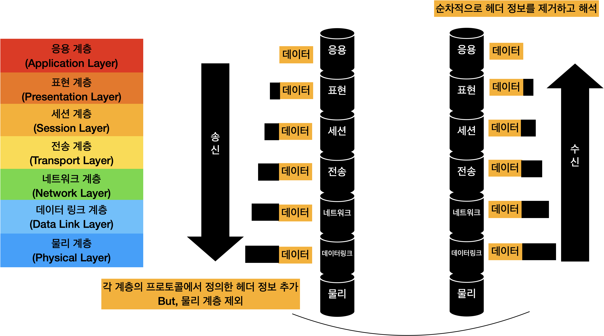

# OSI 7계층

## OSI 7계층 모델

### OSI 참조 모델

- 국제 표준화 기구인 ISO가 확립한 데이터 통신 환경에 적합한 계층적 구현 모델의 표준

### OSI 7계층 모델

- 응용 계층에서부터 물리 계층까지 총 7개의 층으로 이루어짐

### 헤더 정보

- 각 계층에서 수행하는 다양한 정보를 포함
- 오류에 대한 정보일 수도 있고 주소 관련된 정보가 있을 수도 있음. 데이터를 전송할 때, 상위 계층은 데이터에 자신의 프로토콜에서 정의한 헤더 정보를 추가해서 하위 계층으로 보냄
- 이 과정을 물리 계층에서 데이터가 물리적으로 전송될 때까지 반복, 데이터를 수신할 때, 하위 계층에서 상위 계층으로 헤더를 제거하는 과정을 반복, 계층별로 해당 계층의 헤더 정보를 해석하여 처리한 후 상위 계층으로 올려줌
- 따라서 최상위 수신자는 원래의 전송 데이터만 수신, 이때 각 계층의 프로토콜은 정해진 기능을 수행하여 데이터 송신 과정에서 발생하는 문제점을 해결

### 계층 n 프로토콜

계층 n 모듈은 상대 호스트의 계층 n 모듈과 논리적으로 통신할 때 사용하는 규칙

### 동료 프로세스

동일한 계층에 위치한 통신 양단은 같은 프로토콜을 사용하여 통신

### 중개 노드

송신 호스트에서 수신호스트로 데이터를 전달하기 위한 중개 역할을 수행. 이와 같은 경로 배정 기능을 라우팅이라고 한다. 그리고 중개 노드를 라우터라고 한다.

- 라우터는 자신에게 도착한 데이터의 헤더 정보를 해석해서 적절한 경로로 전달하며, 다음 라우터로 보내기 전에 헤더 정보를 수정하는 작업도 진행한다.

### 각 계층의 역할

1. 물리 계층(Physical Layer)
   - 물리적 인터페이스에 관한 사항을 기술
   - 데이터의 전송 속도, 송수신 호스트 사이의 클록 동기화 방법, 물리적 연결 형태 등을 다룸
   - 7계층 중 유일하게 하드웨어적 시스템으로 구현
2. 데이터 링크 계층(Data Link Layer)
   - 물리 계층을 통해 전송되는 데이터의 물리적 전송 오류를 해결
   - 전송 경로를 선택 불가, 두 호스트가 일대일로 연결된 환경에서만 데이터 전송
   - 데이터의 단위로 프레임을 이용
   - 프레임 헤더에 표시되는 송수신 호스트 정보에는 LAN 카드에 내장된 송수신 호스트의 MAC 주소가 기록
   - 흐름 제어 기능도 지원
3. 네트워크 계층(Network Layer)
   - 송신 호스트가 전송한 데이터가 어떤 경로를 통해 수신 호스트에 전달되는지를 결정하는 라우팅 문제를 처리(경로 설정)
   - 전달 경로는 미리 정해진 길을 가는 정적인 방식과 상태에 따라 경로를 설정하는 동적인 방식으로 나누어짐
   - 네트워크 계층의 데이터 단위는 패킷
   - 경로 선택을 위해 호스트 주소, 즉 IP주소가 필요
   - 과도한 트래픽의 증가를 막기 위한 혼잡제어의 역할을 수행
4. 전송 계층
   - 통신 양단에 있는 최종 사용자 사이의 종간 연결을 제공
   - 프로세스와 프로세스 사이의 연결을 설정하여 데이터를 주고받을 수 있게 해줌
   - 하위 계층은 호스트와 호스트 사이의 데이터 전송 과정에서 발생하는 문제들만 반영
   - 반면 전송 계층은 컴퓨터 내부에서 논리적으로 구축되는 통신 당사자인 프로세스 사이에 통신 문제를 다룸
   - 전송 오류율, 전송 속도 등과 같은 일반 사용자의 서비스 요구 유형에 대한 고려와 흐름 제어 기능도 제공
5. 세션 계층
   - 전송 계층과 거의 유사, 하지만 조금 더 상위 계층인 만큼 사용자에게 더 가까운 기능을 수행
   - 대화 제어와, 토큰 제어, 동기 기능을 수행
   - 대화 제어는 대화 내용에 관련된 내용을 수정하는 작업을 하고 토큰 제어는 발언권에 대한 역할을 수행
6. 표현 계층
   - 데이터의 의미와 표현 방법을 처리
   - 변환, 압축 및 암호화 담당
7. 응용 계층
   - 다양하게 존재하는 응용 환경에서 공통을 필요한 기능을 수행
   - http, ftp, telnet 등 사용자에게 서비스를 해주는 모든 부분이 응용 계층의 기능

