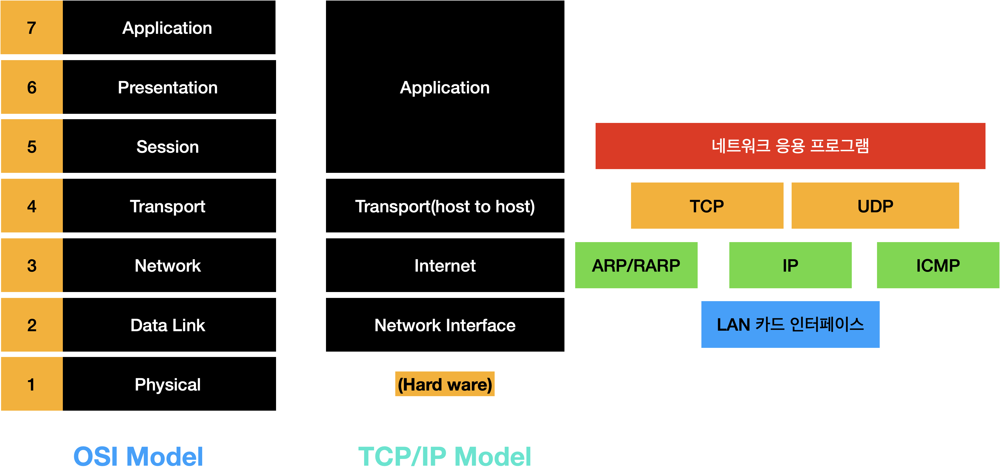

# TCP/IP 모델

## TCP/IP

### TCP/IP의 개념

- 현재 인터넷 통신의 모든 근간이 되는 프로토콜
- TCP와 IP 프로토콜을 중신으로 구성되는 일련의 프로토콜
- TCP와 IP 두 프로토콜만 지칭하는 것이 아니라 관련되는 프로토콜 군을 총칭

### TCP/IP의 장점

- 패킷 단위로 데이터를 전송하면 여러 사용자가 같은 회선을 이용하여 많은 데이터를 동시에 보낼 수 있음
- 데이터를 한꺼번에 보내지 않고 일부분만 보낼 수도 있어서 다양한 종류의 패킷을 동시에 처리 가능
- 통신 도중에 데이터 일부가 손상되어도 해당하는 패킷만 다시 보내면 됨

## TCP/IP 계층 구조

- TCP/IP를 OSI 참조 모델과 비교해 네트워크 접근 계층, 인터넷 계층, 전송 계층, 응용 계층의 4계층으로 표현
- 계층 간 프로토콜의 경꼐나 기능이 확실히 구분되어 있지 않다는 단점이 있음

### 시스템 공간

- TCP(연결형 서비스 제공)와 UDP(비연결형 서비스 제공)는 시스템 운영체제인 커널 내부에 구현됨, 사용자가 직접 이용 불가
- 네트워크 계층은 IP로 구현, 전송 패킷의 올바른 경로 선택 기능을 제공

### 사용자 공간

- 사용자 프로그램으로 구현
- 전송 계층의 기능을 제공하는 소켓 시스템 콜을 호출에 TCP와 UDP 기능을 사용

### TCP/IP 계층 구조

1. 네트워크 접근 계층
   - OSI 참조 모델의 물리 계층과 데이터 링크 계층에 해당
   - 하드웨어적인 요소에 관련된 모든 것을 지원
2. 인터넷 계층
   - 주요 기능으로 전송 계층으로부터 받은 데이터에 IP 패킷 헤더를 붙여 IP 패킷을 만들고 이를 전송
3. 전송 계층
   - 신뢰성 있는 데이터 전송을 보장
4. 응용 계층
   - OSI 참조 모델의 세션 계층, 표현 계층, 응용 계층을 모두 결합
   - SMTP(이메일 프로토콜), FTP(파일 전송 프로토콜), DNS(도메인명 시스템), WWW(웹 프로토콜) 등

### 프로토콜

1. TCP/UDP
   - 사용자 데이터를 전송하는 전송 계층 프로토콜
2. IP
   - 사용자 데이터를 전송하는 네트워크 계층 프로토콜
   - 오류 정보를 전송하는 목적으로 ICMP를 사용
3. ARP와 RARP
   - ARP: IP 주소를 MAC 주소로 변환
   - RARP: MAC 주소를 IP 주소로 변환
4. ICMP
   - 오류 메시지를 전송하는 프로토콜
   - IP 프로토콜에 캡슐화되어 전송됨