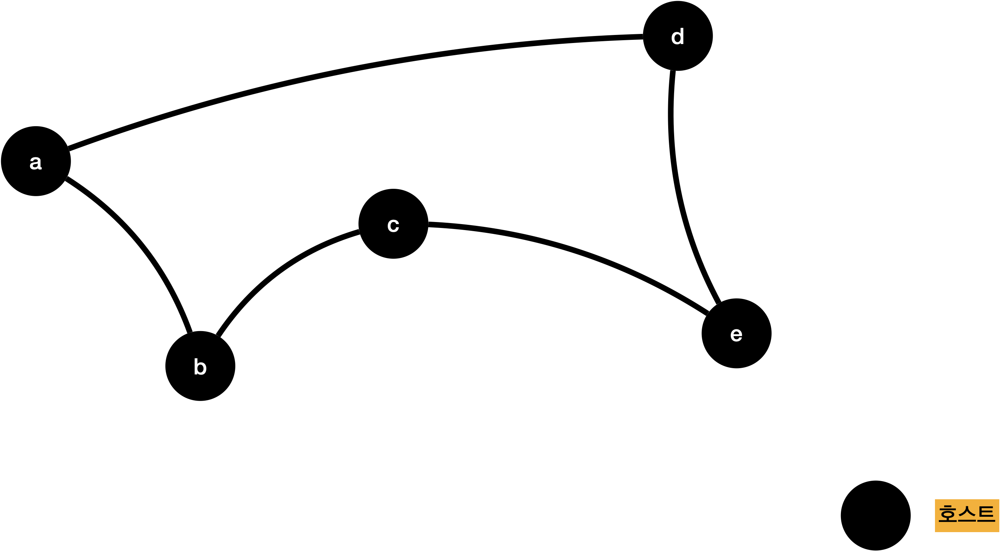
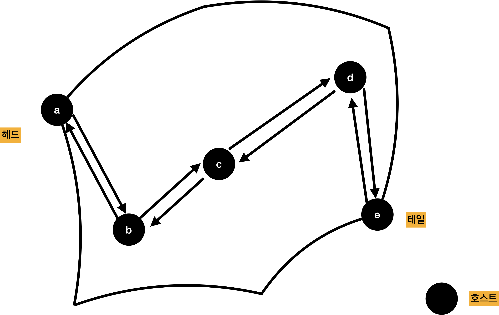

# LAN, MAN, WAN

## LAN, MAN, WAN

- 컴퓨터 네트워크를 분류하기 위한 가장 간단한 기준은 네트워크의 크기
- 컴퓨터 시스템의 내부와 컴퓨터 네트워크의 차이는 전송 매체의 성능에 있다.
- 시스템은 빠른 속도와 높은 전송 대역을 지원하기 때문에 밀접한 연결 관계를 갖는다.
- 네트워크 전송 매체는 속도가 상대적으로 느려 느슨한 연결 관계를 지원

## 브로드캐스트, 유니캐스트, 멀티캐스트

### 브로드캐스트

- 자신의 호스트가 속해 있는 네트워크를 대상의 모든 수신자에게 패킷을 전송하는 방법

### 유니캐스트

- 하나의 송신자가 하나의 수신자에게 데이터를 전송하는 방법

  

### 멀티캐스트

- 한 번의 송신으로 메시지나 정보를 목표한 여러 컴퓨터에 동시에 전송하는 것 

  

## LAN

- LAN은 단일 건물이나 학교 같은 소규모 지역에 위치하는 호스트로 구성된 네트워크
- 브로드캐스팅 방식으로 전송
- 호스트 사이의 물리적 거리에 영향을 많이 받음
- 보통 수십 Mbps~수 Gbps 전송 속도 지원
- 호스트를 연결하는 방식을 구성 형태에 따라 버스형, 링형으로 구분

### 버스형

- 공유 버스 하나에 여러 호스트를 직접 연결

- 한 호스트가 전송한 데이터를 네트워크에 연결된 모든 호스트에 전송하므로 브로드캐스팅 방식

- 라우팅 기능 따로 필요 없음

- 둘 이상의 호스트에서 동시에 전송하려고 하면 공유 버스에서 데이터 충돌이 발생 가능

- 충돌 문제 해결 방법 = 충돌 발생 가능성 자체를 차단, 충돌을 허용하고 나중에 해결하는 방식이 존재

- 버스형 연결형태인 이더넷(Ethernet)은 충돌 발생을 허용하는 대신, 충돌 후에 문제를 해결하는 사후 해결 방식

  

### 링형

- 전송 호스트의 연결이 순환인 링 형태
- 데이터는 시계나 반시계 방향으로 전송, 전송한 데이터는 링을 한 바퀴 돌아 송신 호스트로 되돌아옴
- 네트워크에서 연결된 모든 호스트가 전송 데이터를 수신하는 브로드캐스팅 방식
- 데이터를 송신한 호스트는 자신에게 되돌아온 테이터를 네트워크에서 회수할 책임이 있음
- 둘 이상의 호스트에서 데이터를 동시에 전송하면 충돌 발생 가능
- 링형에서는 토큰(Token) 이라는 제어 프레임을 사용해 충돌 가능성을 미리 차단
- 토큰: 데이터를 전송할 호스트는 사전에 전송용 토큰 확보 필요
  - 네트워크에는 토큰이 하나만 존재하도록 설계
  - 특정 시간에 데이터를 전송할 수 있는 호스트는 하나 뿐
  - 토큰은 네트워크에 연결된 호스트를 모두 순환하도록 설계되었기 때문에 모든 호스트가 동등한 전송 기회를 가짐

## MAN(Metropolitan Area Network)

- MAN은 LAN보다 큰 지역을 지원, 연결 규모가 더 큼
- 근처에 위치한 여러 건물이나 한 도시에서의 네트워크 연결로 구성 가능
- DQDB(Distributed Queue Dual Bus) 구조 지원
  - 전송 방향이 다른 두 버스로 모든 호스트를 연결하는 구조 지원

## WAN(Wide Area Network)

- 국가 이상의 넓은 지역을 지원하는 네트워크 구조
- 점대점으로 연결된 WAN 환경은 전송과 더불어 교환 기능이 반드시 필요
- WAN은 전송 매체를 이용해 호스트를 일대일로 연결하는 방식으로 네트워크를 확장
- 연결의 수가 증가할수록 전송 매체 비용이 많이 팔요함

