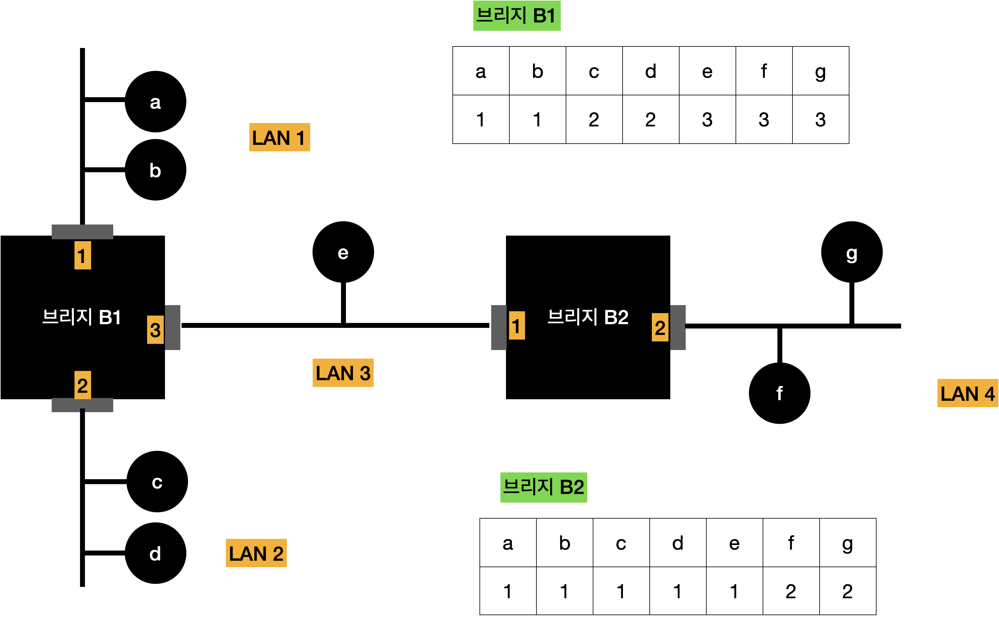
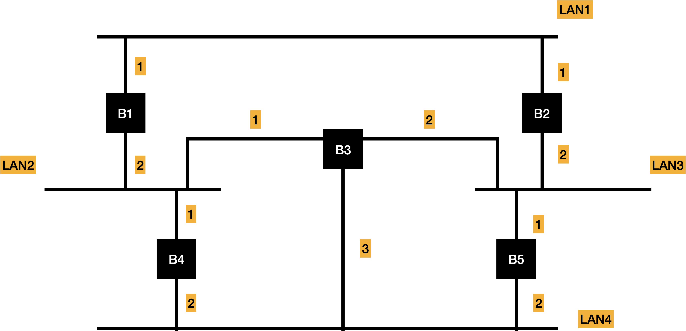

# 인터네트워킹

## 인터네트워킹

- 둘 이상의 서로 다른 네트워크를 연결하는 기능
- 두 개의 네트워크를 연결하는 장비는 역할이 어느 계층에 속하느냐에 따라 종류가 달라짐
  - 일반적으로 하위 3 계층인 물리, 데이터링크, 네트워크 계층의 기능을 수행
  - 특별히 네트워크 계층까지의 기능을 수행하는 장비는 라우터
- 게이트웨이: 일반적인 용어
  - **리피터** : 계층 1 기능을 지원
  - **브리지** : 계층 2 기능을 지원
  - **라우터** : 계층 3 기능을 지원, 경로 배정 기능을 수행
- 라우터
  - 교환 기능 수행
  - 여러 포트를 사용해 다수의 LAN을 연결하는 구조 지원
- 브리지
- 리피터
  - 한쪽 단에서 들어온 비트 신호를 증폭하여 다른 단으로 단순히 전달

## 브리지

- 연결되는 LAN이 다른 종류일 경우 프레임 해석, 변환 등의 복잡한 작업 필요
- 브리지에 연결되는 LAN 종류만큼 MAC/물리 계층을 처리해야 함

### 트랜스페런트 브리지(Transparent Bridge)

- 라우팅 기능을 사용자에게 투명하게 보여줌
- 브리지 사용자는 프레임에 라우팅 정보를 추가하지 않아도 됨
- 브리지의 수행 동작
  1. 프레임의 송수신자가 동일 방향에 위치하면 수신 프레임 무시
  2. 프레임의 송수신자가 다른 방향에 위치하면 수신자 방향으로 프레임 중개

### 라우팅 테이블

- **역방향 학습 (Backward Learning) 알고리즘** : 라우팅 정보를 얻는 방식
  - Lan이 동작하면서 자동으로 생성, 초기에는 라우팅 테이블의 내용이 비어 수신자가 어느 포트에 위치하는지 판단 X
- **플러딩** : 프레임을 브리지의 모든 포트방향으로 전달. **단, 프레임이 들어온 방향으로는 전달 X**

### 스패닝 트리

- 네트워크의 비순환 구조
- **스패닝 트리 알고리즘** : 비순환 구조를 지원하는 알고리즘

- 결정된 포트 = 전송 포트
- 결정되지 않은 포트 = 저지 포트

## 인터넷 라우팅

### 고정 경로 배정

- 송수신 호스트 사이의 영구불변의 경로를 배정
- 장점: 간단하지만 효율적인 라우팅이 가능
- 단점: 트래픽 변화에 따른 동적 경로 배정이 불가능

### 적응 경로 배정

- 인터넷 연결 상대가 변하면 이를 전달 경로 배정에 반영
  - 특정 네트워크나 라우터가 비정상적으로 동작하는 경우
  - 네트워크의 특정 위치에서 혼잡이 발생하는 경우
- 단점: 경로 과정에서 라우터의 부담이 증가
- 구성체
- 라우터 사이의 시간적인 정보의 불일치성 문제가 항상 존재

## 자율 시스템(Autonomous System)

- 동일한 라우팅 특성으로 동작하는 논리적인 단일 구성체
- 다수의 라우터로 구성, 공통의 라우팅 프로토콜을 사용해 정보 교환
  - **내부 라우팅 프로토콜** : 자율 시스템 내부에서 사용
  - **외부 라우팅 프로토콜** : 자율 시스템 간에 사용