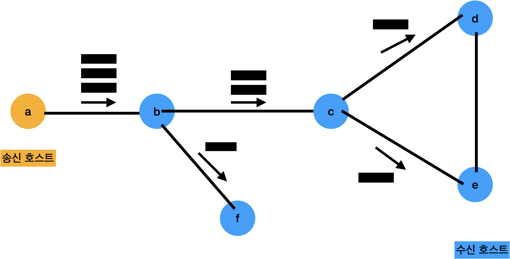
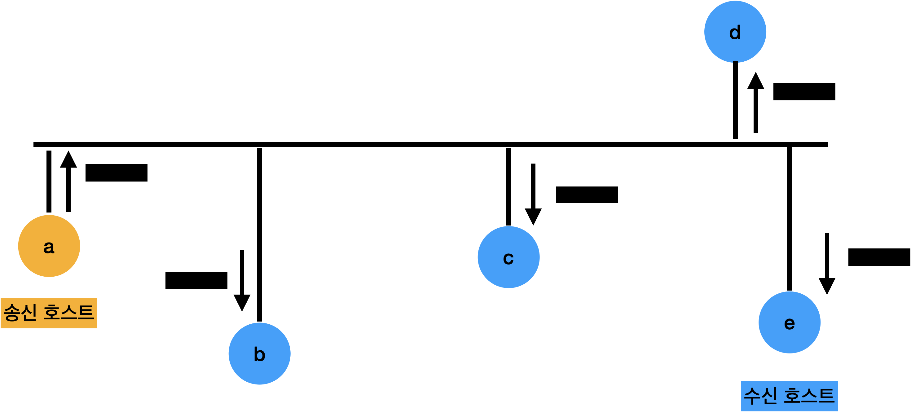

# 데이터 전송 방식

## 컴퓨터 네트워크 효과

### 자원 공유

- 컴퓨터 하드웨어, 소프트웨어 등 모든 종류의 물리적, 논리적 자원을 공유
- 자원 활용의 극대화 -> 네트워크 발전의 1차적 요인

### 병렬 처리에 의한 성능 향상

- 하나의 공유 시스템 버스에 다수의 메인 프로세서를 장착
- I/O 장치의 처리속도를 향상시키기 위해 I/O 전용 프로세서를 설치
- 시스템이 수행할 직업을 분할해 동시에 처리 -> 처리시간 단축

### 중복 저장으로 신뢰성 향상

- 중복 저장되므로 데이터 복구가 용이함
- 신뢰성의 향상 정도만큼 시스템 성능은 저하됨

## 전송과 교환

- 교환 Switching
  - 전달 경로가 둘 이상일 때, 라우터에서 데이터를 어느 방향으로 전달할지를 선택하는 기능
- 전송 Transmission
  - 일대일(1:1)로 직접 연결된 두 시스템 간의 신뢰성 있는 데이터 전송을 보장
  - 전송에는 라우팅 개념이 포함되지 않음

## 점대점 방식

- 호스트 간의 데이터 전달 과정에서 송신 호스트가 중개 호스트와 일대일로 연결되므로 다른 호스트에는 데이터가 전달되지 않음
- 교환 호스트가 송수신 호스트의 중간에 위치 (스타형, 링형, 완전형, 불규칙형)
- 연결 개수가 많아지면 성능은 유리하나 비용이 많이 소요, 연결 개수가 적어지면 전송 매체를 많이 공유해 네트워크 혼잡도 증가
- 원거리에 있는 시스템 사이의 통신 방식으로 WAN 환경에서 주로 사용

### 스타형

- 하나의 중개 호스트 주위로 여러 호스트를 일대일로 연결하는 형태
- 중앙 호스트의 신뢰성과 성능이 네트워크에 영향을 줌
- 중계 기능을 중앙 호스트가 독점적으로 담당

### 트리형

- 스타형을 다단계로 확장한 구조 -> 트리형
- 트리형에서는 주변 호스트가 중개 호스트로 확장되는 과정을 반복해 네트워크를 무한대로 펼칠 수 있음
- **트리형 장단점** : 중계 과정이 간단하나 중앙 호스트에 문제 발생시 전체 네트워크의 동작에 영향을 줌

### 링형

- 전송 데이터가 브로드캐스팅 되지만, 호스트가 일대일로 직접 연결되기 때문에 점대점 방식에도 포함됨
- 호스트의 연결이 순환 고리 구조
- 모든 호스트가 데이터 전송과 교환 기능을 동시에 수행
- 충돌 발생 시 송신 시점을 제어하는 기능 -> 토큰 Token
  1. 호스트 사이의 데이터 송신 시점을 제어하는 기능
  2. 데이터의 전송 권한을 의미하는 토큰을 확보
  3. 데이터 전송이 완료되면 토큰을 다시 링 네트워크에 돌려줌
- 단점: 한 호스트가 고장나면 전체 네트워크가 동작하지 않을 수 있음

### 완전형

- 모든 호스트가 다른 모든 호스트와 일대일로 직접 연결하는 방식
- 호스트끼리 전용 전송 매체로 직접 연결하기 때문에 교환 기능 필요 없음
- 단점: 전송 매체가 증가하면 비용 측면이 비효율적임

### 불규칙형

- 연결 구조를 특정 패턴으로 분류할 수 없는 방식(일반 네트워크)
- 여러 환경 요인에 의해 연결 구조가 결정

## 브로드캐스팅 방식

- 특정 호스트가 전송한 데이털가 네트워크에 연결된 모든 호스트에 전달
- LAN 환경에서 사용(교환 호스트 불필요)
- 송신 호스트에서 보낸 데이터가 네트워크의 모든 호스트에 전달
- 따라서 데이터를 수신하도록 지정된 호스트는 해당 데이터를 수신하고 보관하지만, 다른 호스트들은 수신 데이터를 버림
- 종류: 버스형, 링형

### 버스형

- 전송 데이터를 모든 호스트에서 수신할 수 있음
- **충돌(Collision)** : 둘 이상의 호스트에서 데이터를 동시에 전송할 때 충돌 발생
- 충돌 해결 방법
  1. 호스트의 전송 권한을 제한함
     - 사전에 전송 권한을 확보하는 방법: 시간대를 다르게 지정하는 방법, 토큰으로 전송 권한을 순환적으로 이용하는 방법
  2. 충돌 허용
     - 둘 이상의 호스트가 데이터를 동시에 전송할 수 있도록 허용하고 충돌 발생 시에 해결 과정 필요 Ex) **이더넷(Ethernet)**

### 링형

- 호스트를 순환 구조로 연결
- 송신 호스트가 전송한 데이터는 링을 한 바퀴 순환한 후 송신 호스트에 되돌아옴
- 중간의 호스트 중에서 수신 호스트로 지정된 호스트만 데이터를 내부에 저장
- 데이터를 전송하기 위해서는 토큰 확보가 필수

## 멀티 포인트 통신

- 유니 캐스팅 Unicasting 방식
  - 두 호스트 사이의 데이터 전송 (텔넷, FTP, 웹 검색)
- 멀티 포인트 Multipoint
  - 일대다(1:n), 다대다(n:m) 형식 (화상 회의, 원격 교육, 인터넷 채팅)
- 하나의 송신 호스트를 기준으로
  - **수신 호스트 하나와 연결** : 유니 포인트(Unipoint)
  - **다수의 수신 호스트와 연결** : 멀티 포인트(Multipoint)
- 송신 호스트가 한 번의 전송으로 
  - **수신 호스트 하나에만 데이터 전송** : 유니캐스팅(Unicasting)
  - **다수의 수신 호스트 전송** : 멀티캐스킹(Multicasting)

### 멀티포인트 유니캐스팅

- 유니캐스팅 방식을 이용해 일대다 통신을 하기 위해 멀티포인트 유니캐스팅 방식 사용
- 단점: 수신 호스트 수가 많아지면 성능에서 문제 발생
- 장점: 송수신 호스트 사이의 흐름 제어와 수신 호스트의 응답 기능 및 재전송 기능 등을 구현하기 좋음

### 브로드캐스팅

- 네트워크에 연결된 모든 호스트에 전송되는 방식
- 단점: 호스트 수가 많을수록 네트워크 트래픽이 급격히 증가 (서브넷 Subnet 내에서 이용이 좋음)
- 특정한 브로드캐스팅 주소로 전송
- 네트워크 장비에서는 전달된 패킷을 복사하여 네트워크 전체로 전송

