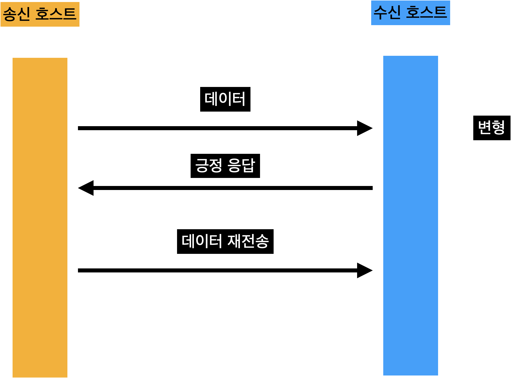

# 오류 제어

## 오류 제어

- 데이터 링크 계층 프로토콜이 전송 오류 기능을 제공하려면 오류 발생 여부를 인지할 수 있어야 함
- 오류의 종류에는 데이터가 깨져서 도착하는 프레임 변형 / 데이터가 목적지에 도착하지 못하는 프레임 분실
- 오류를 감지하면 오류를 복구하는 과정이 진행, 컴퓨터 네트워크에서는 일반적으로 송신 호스트가 원래 데이터를 재전송하는 기법을 사용

## 전송 오류의 유형

### 오류 복구 기능

- 수신 호스트의 응답 프레임: 송신 호스트에 응답 프레임을 전송해 원래의 데이터 프레임을 재전송하도록 요구
  - 긍정 응답 프레임: 데이터 프레임이 정상적으로 도착했을 때 회신
  - 부정 응답 프레임: 송신 호스트의 재전송 기능 작동
- 송신 호스트의 타이머 기능
  - **타임 아웃 (Timeout)** : 데이터 프레임을 전송한 후에 일정 시간 이내에 수신 호스트로부터 긍정 응답 프레임 회신이 없으면 데이터 프레임을 재전송 함
- 순서 번호 기능
  - 수신 호스트가 보낸 긍정 응답 프레임을 분실하면 데이터 프레임이 제대로 도착해도 송신 호스트가 인지 불가능
  - 따라서 숭신 호스트가 타임아웃 기능에 의해 원래 프레임을 재전송함으로써 수신 호스트가 데이터 프레임을 중복 수신하는 결과 초래
  - 이럴 때 데이터 프레임 내에 프레임 구분을 위한 일련번호 부여
- 데이터 프레임은 원래 데이터 외에 오류 검출을 위한 정보도 함께 제공
- 오류 검출을 위한 정보에는 수신 호스트에서 오류를 감지하는 기능만 하는 정보와 오류가 발생한 프레임을 복구하는 기능을 하는 정보가 존재
- 오류 감지만 하는 방법을 사용할 때는 송신 호스트의 도움을 받아 오류 복구의 기능을 수행
- 올바르게 수신하면 송신 호스트가 긍정 응답 프레임을 전송함으로써 송수신 호스트 사이에 전송 완결
- 그러나 프레임 변형 오류가 발생하면 부정 응답 프레임을 회신해 송신 호스트의 재전송 기능에 따라 오류 복구 과정을 진행

### 정상적인 전송

- 송신 호스트가 전송한 데이터 프레임이 수신 호스트에 오류 없이 도착
- 수신 호스트는 송신 호스트에게 긍정 응답 프레임을 회신

### 프레임 변형

- 프레임 변형 오류를 인지한 수신 호스트는 송신 호스트에 부정 응답 프레임을 전송, 원래의 데이터 프레임을 재전송
- 부정 응답 프레임을 사용하지 않는 프로토콜에서는 송신 호스트의 타임아웃 기능에 따라 복구 과정을 시작

### 프레임 분실

- 송신 호스트는 데이터 프레임을 전송한 후에 특정 시간까지 수신 호스트의 긍정 응답 프레임이 도착하지 않으면 타임아웃 기능에 따라 원래의 프레임을 스스로 재전송

## 순서 번호

- 중복 수신 문제를 해결하기 위해 데이터 프레임에게 부여되는 고유 번호
- 순서 번호의 필요성
  - 긍정 응답 프레임이 사라지는 오류 발생 시 송신 호스트의 타임아웃 기능에 따라 재전송 과정이 진행됨
  - 동일한 프레임 중복 수신
- 수신 호스트가 두 경우(긍정 응답 분실, 긍정 응답 도착)을 구분할 수 있도록 데이터 프레임별로 고유의 순서 번호를 부여하는 방식이 필요함

### 순서 번호의 의한 프레임 구분

- 순서 번호에 근거하여 동일한 데이터 프레임이 중복 도착 여부를 확인 가능

## 흐름 제어

- 수신 호스트가 감당할 수 있을 정도의 전송속도를 유지하면서 데이터 프레임을 전송
- 너무 빨리 전송하는 경우
  - 수신 호스트가 내부 버퍼에 보관하지 못할 수 있음
  - 이는 프레임 분실과 동일한 효과를 야기함
- 기본 원리
  - 수신 호스트가 송신 호스트의 전송 시점을 통지
  - 대표적인 예: 슬라이딩 윈도우 프로토콜