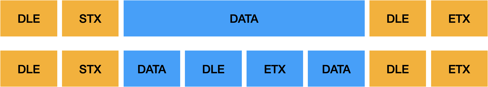
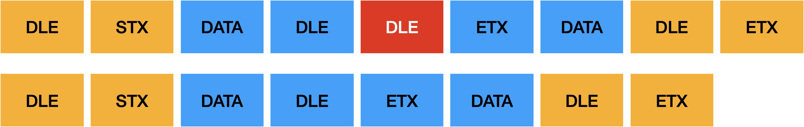
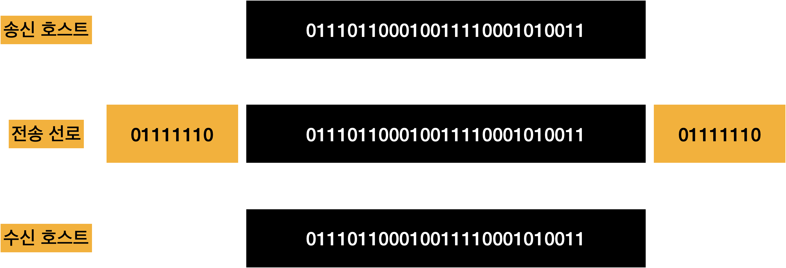
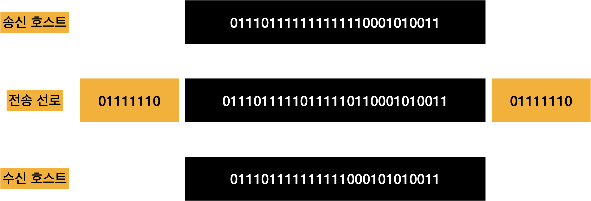

# 프레임

## 프레임

- 데이터 링크 계층: 전송 데이터를 프레임이라는 단위로 나누어 처리
- 전송프레임: 체크섬(Checksum), 송수신 호스트의 주소, 제어 코드 등 정보 포함
- 내부정보를 표현하는 방식에 따라 문자 프레임과 비트 프레임으로 구분

## 문자 프레임(Character Frame)

- 내용이 문자로만 구성
- 8비트 단위(또는 ASCII 문자 코드) 의 고정크기로 동작

### 프레임의 구조

- 프레임의 시작과 끝에 특수문자 사용
  - **시작: DLE / STX**
  - **끝: DLE / ETX**
- 전송 데이터에 특수 문자가 포함되면 혼선이 발생

### 문자 스터핑

- 내부의 전송 데이터에 DLE 문자가 포함되면서 발생하는 혼란을 예방하는 방법
- 송신 호스트가 전송하는 데이터를 미리 조작함으로써 혼선의 여지를 없앰
- 전송 데이터가 DLE 문자를 포함하면 뒤에 DLE 문자 하나를 강제로 추가
- 수신 호스트는 데이터에 DLE 문자가 두 번 연속 있으면 하나의 DLE 문자 삭제

## 비트 프레임(Bit frame)

- 문자 단위의 가정을 없앰
- 프레임의 시작과 끝 위치에 플래그(Flag)라는 특수하게 정의된 비트 패턴(01111110)을 이용해 프레임 단위를 구분

### 프레임의 구조

- 데이터 전송 전에 프레임의 자우에 플래그를 추가, 수신 호스트는 이 플래그를 제거해 전송 데이터와 필요한 제어 정보를 상위 계층 전달

### 비트 스터핑

- 전송 데이터에 플래그 패턴이 포함되면 혼선이 발생
- 송신 호스트: 전송 데이터가 1이 연속해서 5번 발생하면 강제로 0을 추가
- 수신 호스트: 송신 과정에 추가된 0을 제거하여 원래의 데이터를 상위 계층 전달

